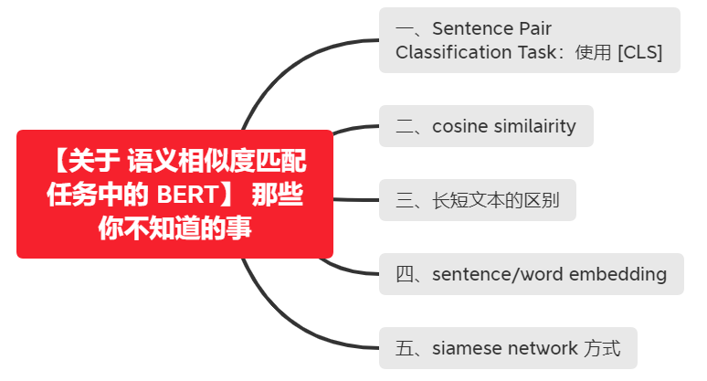
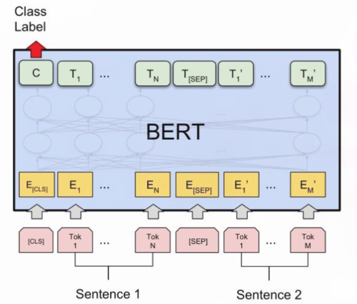

# 语义相似度匹配任务中的BERT

> 作者：杨夕
> 
> 项目地址：https://github.com/km1994/NLP-Interview-Notes
> 
> 个人论文读书笔记：https://github.com/km1994/nlp_paper_study
> 
> 个人介绍：大佬们好，我叫杨夕，该项目主要是本人在研读顶会论文和复现经典论文过程中，所见、所思、所想、所闻，可能存在一些理解错误，希望大佬们多多指正。

## 一、Sentence Pair Classification Task：使用 [CLS] 

- 方法：
  - 1. 将输入送入BERT前，在首部加入[CLS]，在两个句子之间加入[SEP]作为分隔；
  - 2. 取到BERT的输出（句子对的embedding），取[CLS]即可完成多分类任务/相似度计算任务；
  - 3. 取到的[CLS]对应的embedding为 c；
    - 3.1. 多分类任务，需进行：P = softmax(cW')；
    - 3.2. 相似度计算，需进行：P = sigmoid(cW')；
  - 4. 计算各自所需的loss；
  
- 解析：c 可一定程度表示整个句子的语义

## 二、cosine similairity

- 方法：
  - 1. 利用 bert 生成两个句子的句向量；
  - 2. 在不finetune的情况下，计算 cosine similairty 绝对值；
- 问题：不合理的
- 原因：bert pretrain计算的cosine similairty都是很大的；
  - 如果直接以cosine similariy>0.5之类的阈值来判断相似不相似那肯定效果很差；
  - 如果用做排序，也就是cosine(a,b)>cosine(a,c)->b相较于c和a更相似，是可以用的；
- 评价指标：auc，而不是accuracy；

## 三、长短文本的区别

- 短文本（标题）语义相似度任务：用word embedding（英文fasttext/glove，中文tencent embedding）mean pooling后的效果就已经不错；
- 长文本（文章）：用simhash这种纯词频统计的完全没语言模型的简单方法也可以；

## 四、sentence/word embedding

bert pretrain模型直接拿来用作 sentence embedding效果甚至不如word embedding，CLS的emebdding效果最差（也就是pooled output）。

把所有普通token embedding做pooling勉强能用，但也不会比word embedding更好。

## 五、siamese network 方式

- 思路：除了直接使用bert的句对匹配之外，还可以只用bert来**对每个句子求**embedding，再通过向Siamese Network这样的经典模式去求相似度；
- 用siamese的方式训练bert，上层通过cosine做判别，能够让bert学习到一种适用于cosine作为最终相似度判别的sentence embedding，效果优于word embedding，但因为缺少sentence pair之间的特征交互，比原始bert sentence pair fine tune还是要差些。
